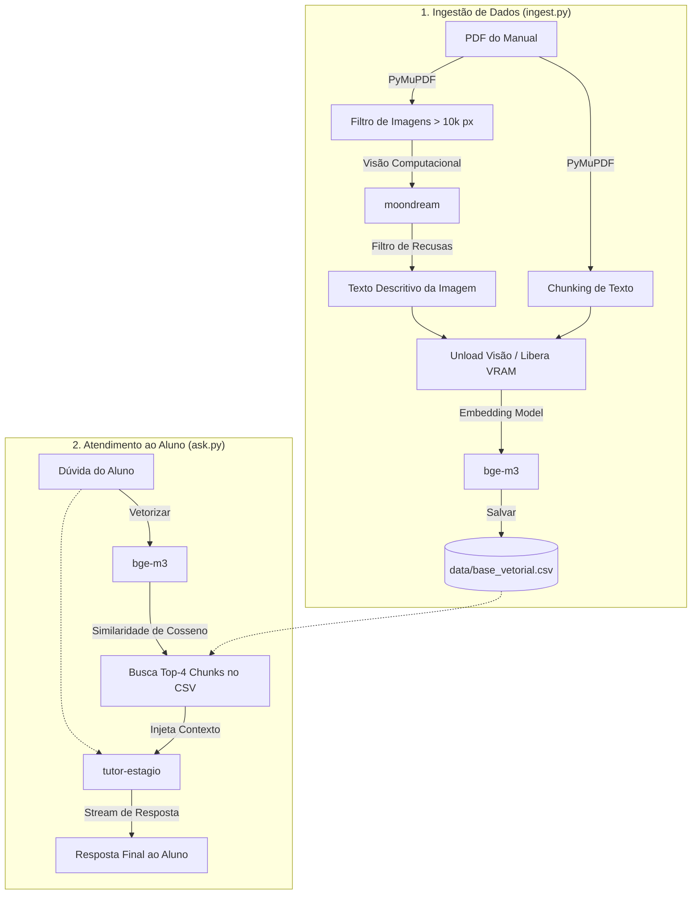

# Tutor IA — RAG Multimodal para Manuais Acadêmicos

Sistema de **Retrieval-Augmented Generation (RAG) Multimodal 100% Local** projetado para processar documentos PDF universitários (contendo texto, capturas de tela, tabelas e fluxogramas) e responder a dúvidas de alunos de forma precisa e contextualizada.

---

## 🚀 Guia de Instalação e Execução

### 1. Pré-requisitos
* **Python 3.10** ou superior.
* **Ollama** instalado e rodando em sua máquina (`http://localhost:11434`).

### 2. Preparação do Ambiente Python

No terminal do seu sistema operacional, dentro da pasta do projeto:

```bash
# Criar ambiente virtual
python -m venv .venv

# Ativar o ambiente virtual
# No Windows (PowerShell):
.venv\Scripts\Activate.ps1
# No Linux/macOS:
source .venv/bin/activate

# Instalar dependências necessárias
pip install pymupdf ollama pandas numpy scikit-learn
```

### 3. Download dos Modelos no Ollama

Certifique-se de que o serviço do Ollama está em execução e rode os seguintes comandos no terminal:

```bash
# Modelo de Visão Computacional (Leve, especializado em descrição de imagens)
ollama pull moondream

# Modelo de Embeddings Multilíngue (Gera vetores de 1024 dimensões)
ollama pull bge-m3

# Caso ainda não tenha criado o modelo customizado tutor-estagio:
# O modelo tutor-estagio é baseado em uma LLM local (ex: llama3 / mistral)
```

---

## Comandos para Funcionar

### Passo 1: Processar o PDF e Gerar a Base Vetorial (Ingestão)
Coloque os arquivos PDF a serem processados na pasta `data/` (ex: `data/Manual Estágio Obrigatório_Polo-20262.pdf`) e execute:

```bash
python src/ingest.py
```

> **O que acontece:** O script lê os textos e imagens do PDF, gera as descrições visuais, descarrega a VRAM, calcula os embeddings e salva o banco de dados em `data/base_vetorial.csv`.

### Passo 2: Iniciar o Chatbot (Interface de Consulta)
Após a conclusão do ingest, execute a interface conversacional:

```bash
python src/ask.py
```

> **O que acontece:** O terminal abrirá o chat interativo. Digite suas perguntas e o sistema buscará os trechos mais relevantes no manual para responder. Para encerrar, digite `sair`.

---

## 📁 Estrutura do Projeto

```text
rag/
├── data/
│   ├── Manual Estágio Obrigatório_Polo-20262.pdf   # Documento PDF de entrada
│   └── base_vetorial.csv                          # Banco de dados vetorial gerado
├── src/
│   ├── config.py                                  # Configurações e hiperparâmetros
│   ├── image_processor.py                         # Módulo de extração e filtro de imagens
│   ├── ingest.py                                  # Pipeline de ingestão e geração de embeddings
│   └── ask.py                                     # Interface de consulta e resposta do chatbot
├── .venv/                                         # Ambiente virtual Python
└── README.md                                      # Documentação do projeto
```

---

## Detalhamento dos Arquivos

### `src/config.py`
Centraliza as configurações globais do projeto:
* `EMB_MODEL = "bge-m3"`: Modelo responsável pela geração de embeddings.
* `LLM_MODEL = "tutor-estagio"`: Modelo de linguagem (LLM) que responde ao aluno.
* `VISION_MODEL = "moondream"`: Modelo multimodal para descrever imagens.
* `CHUNK_SIZE` e `OVERLAP`: Parâmetros do fatiamento de texto (1500 caracteres, overlap de 150).
* `MIN_IMG_PIXELS`: Filtro de dimensões para ignorar ícones e logotipos pequenos (< 10.000 px).
* `TOP_K`: Quantidade de trechos mais relevantes recuperados por consulta (Top 4).

### `src/image_processor.py`
Gerencia o processamento de imagens do PDF:
* **Extração:** Converte objetos de imagem do PDF (`PyMuPDF`) em formato PNG em memória.
* **Filtragem por Dimensão:** Ignora imagens pequenas (ícones, linhas decorativas).
* **Descrição com IA:** Envia a imagem para o `moondream` com prompt otimizado para descrever telas, tabelas e etapas de sistemas.
* **Filtro de Recusas:** Analisa a resposta do modelo e descarta frases genéricas de recusa (ex: *"Desculpe, não posso ajudar..."*), garantindo que apenas descrições úteis entrem na base.

### `src/ingest.py`
Pipeline mestre de ingestão de dados:
1. Extrai trechos de texto por página aplicando *chunking* com sobreposição.
2. Extrai e descreve as imagens das páginas via `image_processor.py`.
3. **Gestão de VRAM:** Invoca uma requisição com `keep_alive=0` para descarregar o `moondream` da memória antes da fase de embeddings.
4. Calcula os vetores numéricos de cada trecho (texto e imagem) usando o `bge-m3`.
5. Salva a estrutura completa (ID, Documento, Página, Tipo, Texto/Descrição, Embedding) no arquivo CSV.

### `src/ask.py`
Módulo de busca e geração (RAG):
1. Carrega a base vetorial `data/base_vetorial.csv`.
2. Converte a dúvida digitada pelo aluno em um vetor usando o `bge-m3`.
3. Calcula a **similaridade de cosseno** entre a dúvida e todos os vetores da base.
4. Recupera os `TOP_K` (4) trechos mais relevantes.
5. Injeta os trechos recuperados no prompt de contexto e envia para o `tutor-estagio` gerar a resposta em tempo real.

---

## 🧠 Como Tudo Funciona (Arquitetura Técnica)


